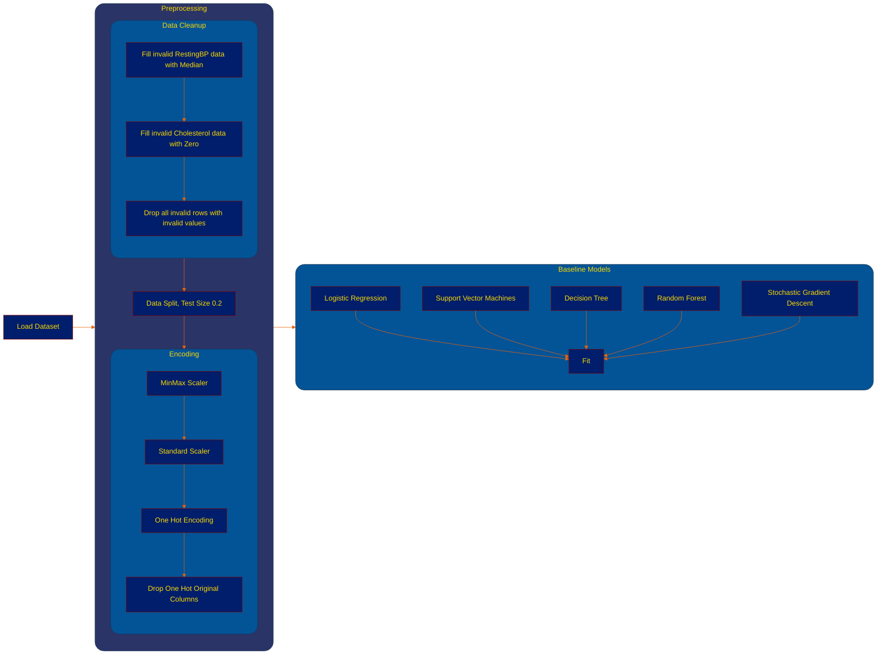

# Heart-Failure-Prediction

## Training Pipeline
> Color Theme: https://colorhunt.co/palette/001e6c035397e8630afcd900

```mermaid
%%{
  init: {
    'theme': 'base',
    'themeVariables': {
      'primaryColor': '#001E6C',
      'primaryTextColor': '#FCD900',
      'primaryBorderColor': '#7C0000',
      'lineColor': '#E8630A',
      'secondaryColor': '#BAD7E9',
      'tertiaryColor': '#035397'
    }
  }
}%%

graph LR
    subgraph prepro[Preprocessing]
        direction TB
        clean --> split[Data Split, Test Size 0.2]
        split --> enc
    end
    style prepro fill:#2B3467,color:#FCD900,rx:20,ry:20;

    subgraph clean[Data Cleanup]
        direction TB
        CA[Fill invalid RestingBP data with Median ] --> CB[Fill invalid Cholesterol data with Zero] 
        CB --> CC[Drop all invalid rows with invalid values]
    end
    style clean color:#FCD900,rx:20,ry:20;


    subgraph enc[Encoding]
        direction TB
        EA[MinMax Scaler] --> EB[Standard Scaler]
        EB --> EC[One Hot Encoding]
        EC --> ED[Drop One Hot Original Columns]
    end
    style enc color:#FCD900,rx:20,ry:20;

    subgraph blmodel[Baseline Models]
        direction TB
        BA[Logistic Regression]
        BB[Support Vector Machines]
        BC[Decision Tree]
        BD[Random Forest]
        BE[Stochastic Gradient Descent]
        BF[Fit]
        BA --> BF
        BB --> BF
        BC --> BF
        BD --> BF
        BE --> BF


    end
    style blmodel color:#FCD900,rx:20,ry:20;

    A[Load Dataset] --> prepro
    prepro --> blmodel

```
